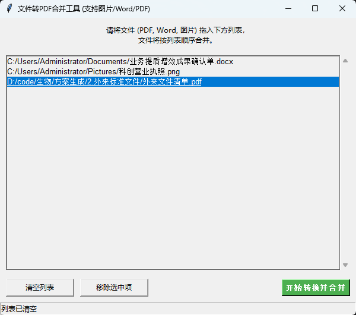

功能说明：
GUI 和 拖拽功能: 使用 tkinter (标准库) 和 tkinterdnd2 (处理拖拽)。
图片转PDF: 使用 Pillow (PIL)。
Word文档转PDF: 使用 docx2pdf (注意：这通常需要电脑上安装了 Microsoft Word)。
PDF合并: 使用 PyPDF2。

使用说明：
1. pip install tkinterdnd2 Pillow PyPDF2 docx2pdf
2. python 运行代码
dist文件夹中也有打包好的程序

Feature Description  
- GUI & Drag-and-drop: built with tkinter (standard library) and tkinterdnd2 (for drag-and-drop support).  
- Image → PDF: powered by Pillow (PIL).  
- Word → PDF: handled by docx2pdf (requires Microsoft Word to be installed on the PC).  
- PDF merge: uses PyPDF2.

Usage  
1. pip install tkinterdnd2 Pillow PyPDF2 docx2pdf  
2. Run the script with python.  
A ready-to-run executable is also provided in the dist folder.
